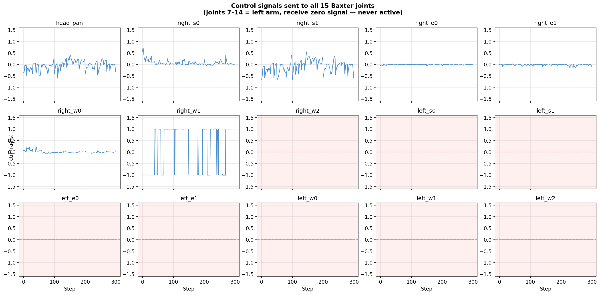
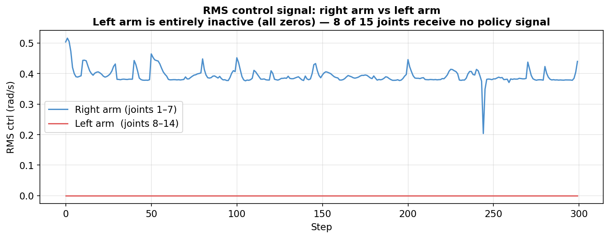
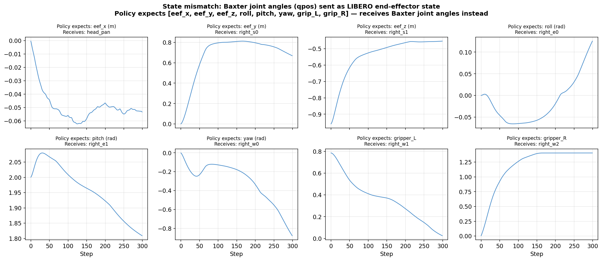
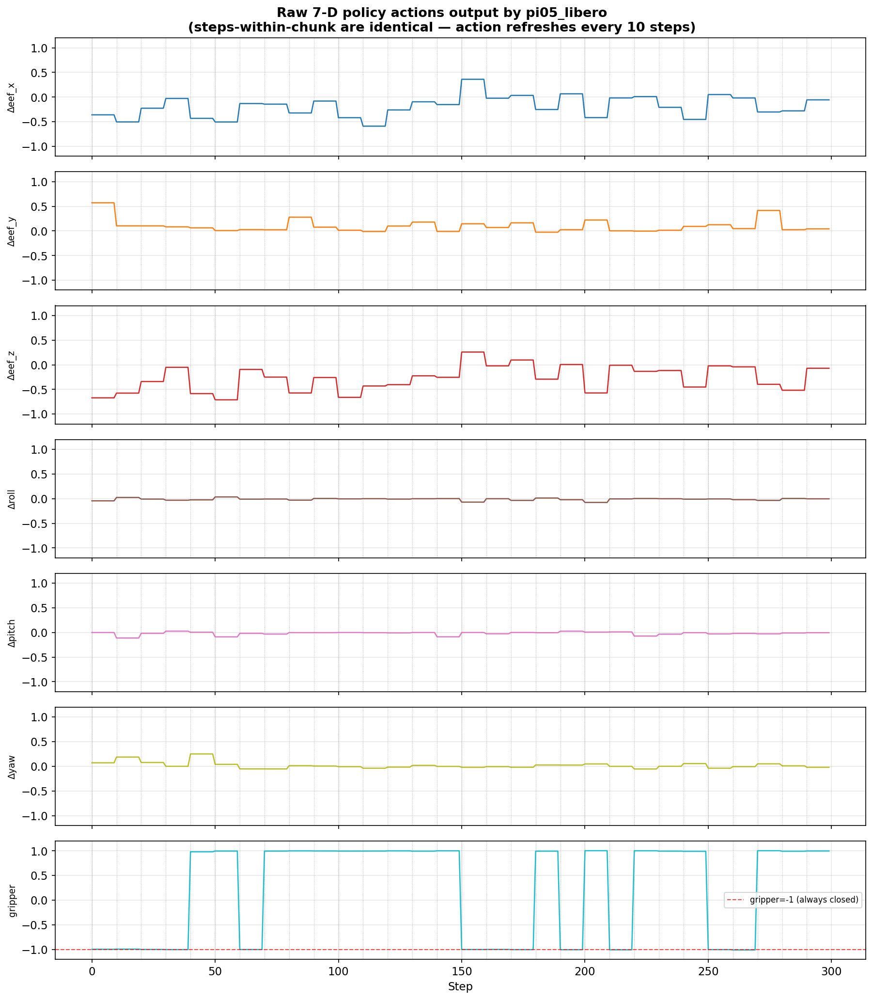
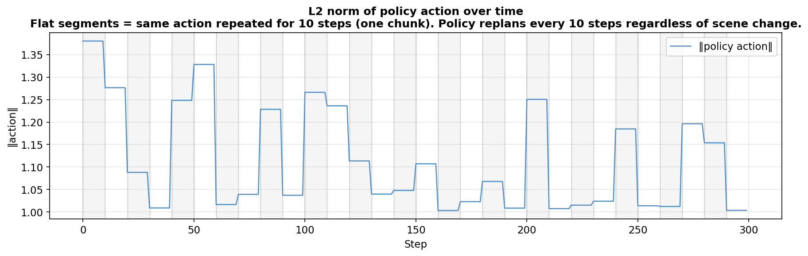
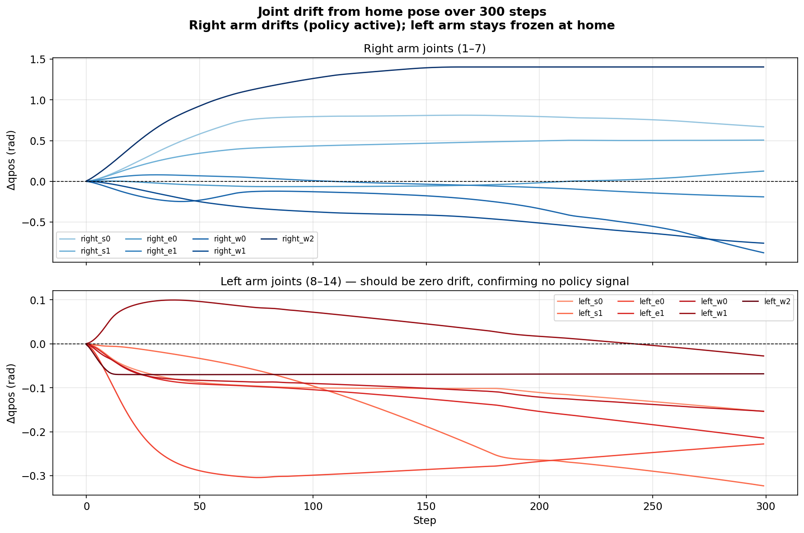

# π0.5 VLA Policy on Baxter MuJoCo Simulation

This repository integrates Physical Intelligence's **π0.5 Vision-Language-Action (VLA)** model with a **Baxter robot** simulated in MuJoCo. The goal is to run language-conditioned robot control in simulation using a pre-trained VLA policy server over WebSocket.

---

## Repository Structure

```
baxter_env.py          — MuJoCo environment wrapper (reset / step / get_obs / render)
run_baxter_vla.py      — Main inference loop (WebSocket client + MuJoCo viewer)
plot_diagnostics.py    — Generates diagnostic plots from a run CSV log
models/
  baxter.xml           — Hand-written MJCF: 15-DOF Baxter, table, cube, 3 cameras
  meshes/              — STL visual meshes
  urdf/baxter.urdf     — Original ROS URDF (reference only)
mujoco_viewer/
  view_baxter.py       — Converts URDF → scene XML, opens interactive viewer
  mujoco_viewer.py     — Minimal viewer for the pre-built scene
requirements.txt       — Python dependencies for this project
openpi/                — π0.5 framework submodule (policy server, training)
data/baxter/
  diagnostics.csv      — Per-step action/state log from a 300-step run
  plots/               — Diagnostic figures (see below)
```

---

## Setup

```bash
# Create and activate virtual environment
python3 -m venv pi0.5_venv
source pi0.5_venv/bin/activate

# Install dependencies
pip install -r requirements.txt
pip install -e openpi/packages/openpi-client   # WebSocket client
```

---

## Running

**Terminal 1 — policy server** (uses openpi's uv environment):
```bash
cd openpi
uv run scripts/serve_policy.py --env LIBERO
```

**Terminal 2 — Baxter simulation**:
```bash
source pi0.5_venv/bin/activate
python run_baxter_vla.py --prompt "pick up the cube" --save-video
```

**Generate diagnostic plots from a run**:
```bash
python plot_diagnostics.py
# plots saved to data/baxter/plots/
```

---

## Why the Policy Doesn't Follow the Language Prompt

Running the `pi05_libero` checkpoint on the Baxter simulation produces motion, but the robot **does not respond to the language prompt**. This section documents the three root causes, each evidenced by diagnostic data from a 300-step run.

---

### 1. Wrong Checkpoint — Policy Was Never Trained on Baxter

The `pi05_libero` checkpoint was trained entirely on the **LIBERO benchmark**, which uses a **7-DOF Franka robot**. It has never observed a Baxter robot's kinematics, visual appearance, or joint configuration. The policy has no learned association between Baxter's state space and meaningful actions.

---

### 2. Action Space Mismatch: 7D End-Effector → 15D Joint Velocity

The LIBERO policy outputs **7-dimensional end-effector actions**:

| Index | Meaning |
|---|---|
| 0–2 | Δend-effector position (x, y, z) |
| 3–5 | Δend-effector orientation (roll, pitch, yaw) |
| 6 | Gripper open/close |

Baxter requires **15-dimensional joint velocity commands** (1 head + 7 right arm + 7 left arm). To bridge this, the 7D output is padded with zeros to 15D — meaning **joints 7–14 (the entire left arm) receive zero velocity at every step**.

**Evidence — Figure 1: Control signals to all 15 joints**



Red panels (joints 7–14) show flat zero lines throughout the entire 300-step run. The left arm never moves.

**Evidence — Figure 2: RMS activity per arm**



The right arm (blue) has non-zero RMS control. The left arm (red) has RMS = 0 for all 300 steps — it is completely inactive.

---

### 3. State Space Mismatch: Joint Angles ≠ End-Effector Pose

The LIBERO policy expects an **8-dimensional state vector** representing the robot's end-effector:

| Index | Meaning |
|---|---|
| 0–2 | End-effector position in Cartesian space (metres) |
| 3–5 | End-effector orientation (radians) |
| 6–7 | Left and right gripper positions |

Instead, it receives the **first 8 Baxter joint angles** (head_pan, right_s0 … right_w1), which are dimensionally and semantically incompatible. For example, the policy "sees" `eef_x = head_pan = -0.0004 rad` and interprets a rotation angle as a Cartesian position in metres.

**Evidence — Figure 4: State mismatch**



Each subplot shows what the policy *expected* to receive (e.g. `eef_x` in metres) versus what it actually received (e.g. `head_pan` in radians). The values are physically and semantically wrong.

---

### 4. Gripper Command Is Always Ignored

`policy_action_6` (gripper) is consistently **≈ -1.0** across all 300 steps — the policy permanently commands the gripper to close. Baxter's model has no gripper, so this signal is entirely discarded.

**Evidence — Figure 3: Raw 7D policy actions**



The gripper channel (bottom panel) is flat at -1.0 for the entire run. Vertical grey lines mark chunk boundaries (every 10 steps) — within each chunk the same action is repeated.

---

### 5. Action Chunks Are Repeated, Not Scene-Reactive

The policy is queried every 10 steps (`--replan-steps 10`). Within each chunk, the **identical action is executed 10 times** regardless of how the scene changes. This means the robot cannot react to its own motion within a chunk.

**Evidence — Figure 6: Action chunk repetition**



The L2 norm of the policy action is constant within each 10-step band, confirming step-level reactivity is absent.

---

### 6. Joint Drift Confirms Only Right Arm Is Driven

**Evidence — Figure 5: Joint drift from home pose**



The right arm joints (blue, top panel) drift progressively from the home pose as the policy drives them. The left arm joints (red, bottom panel) show near-zero drift — confirming they receive no control signal.

---

## Summary of Mismatches

| Dimension | LIBERO Policy Expects | Baxter Simulation Provides | Impact |
|---|---|---|---|
| Robot | 7-DOF Franka | 15-DOF Baxter | Policy kinematics invalid |
| Action space | 7D end-effector Δpose | 15D joint velocities | 8 joints always zero |
| State space | 8D eef pose + gripper | 8 Baxter joint angles | State input semantically wrong |
| Gripper | 1D open/close | No gripper modelled | Signal discarded |
| Training data | LIBERO scenes (Franka) | Baxter MuJoCo scene | No visual generalisation |

---

## What Is Needed to Make It Work

| Approach | Description |
|---|---|
| **Fine-tune on Baxter data** | Collect demonstrations in this MuJoCo sim, convert to LeRobot format, fine-tune `pi05_base` |
| **Add inverse kinematics** | Convert 7D end-effector actions to 15D joint velocities using MuJoCo's Jacobian (`mj_jacSite`) |
| **Try `pi05_droid` checkpoint** | DROID was trained on more diverse robots — may generalise better, but still not Baxter |

The current pipeline is **end-to-end functional** (observation → WebSocket → policy server → action → simulation). The missing piece is Baxter-specific training data or an IK bridge to make the policy's output physically meaningful for Baxter.

---

## Baxter MJCF Model Details

| Property | Value |
|---|---|
| Degrees of freedom | 15 (1 head + 7 right arm + 7 left arm) |
| Actuator type | Velocity-controlled |
| Cameras | `head_camera` (60°), `right_hand_camera` (90°), `left_hand_camera` (90°) |
| Simulation timestep | 2 ms (RK4 integrator) |
| Home keyframe | s1 = -0.96 rad, e1 = 2.0 rad, w1 = 0.785 rad (both arms) |
